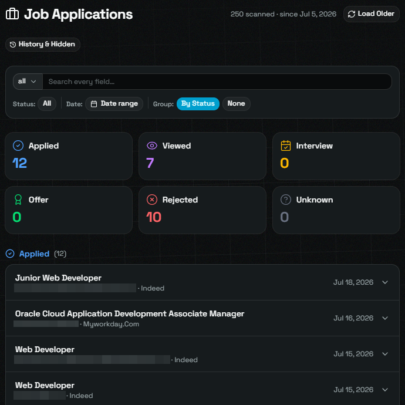
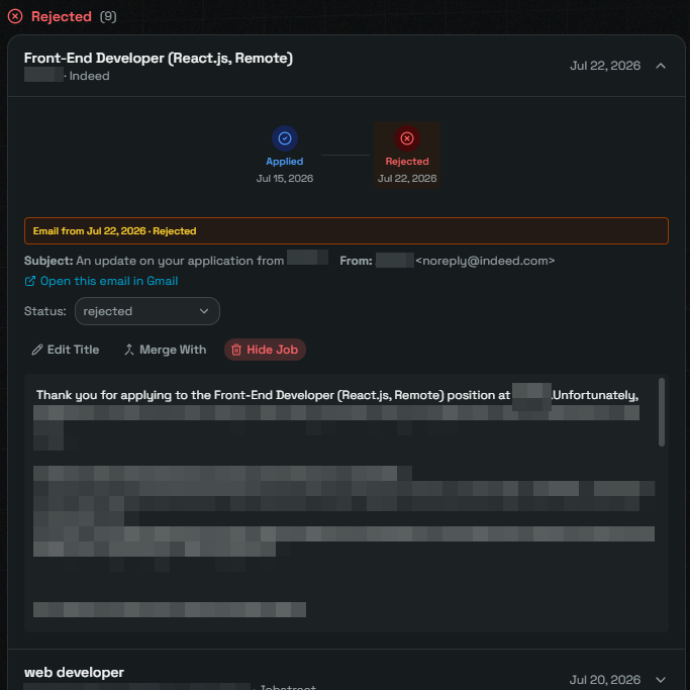
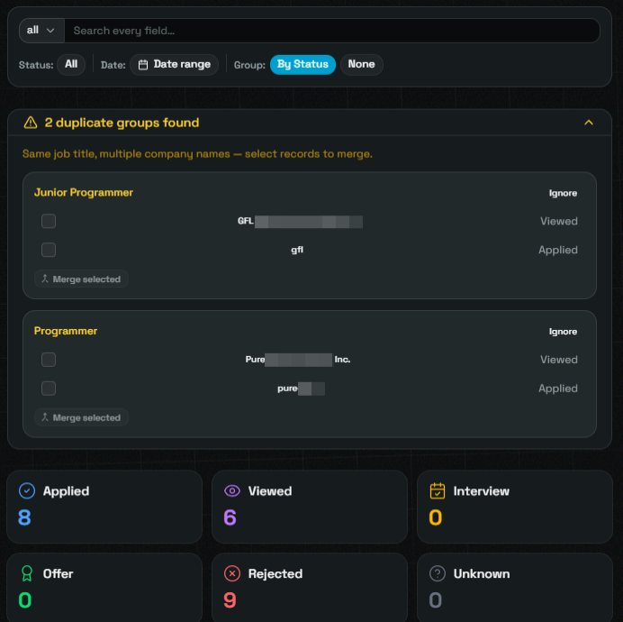
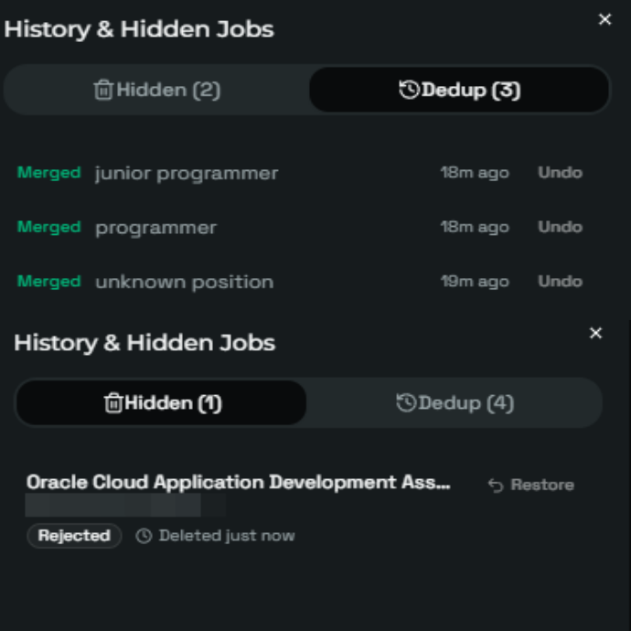

<h1 align="center">ejobtrack</h1>

<p align="center">
  <b>Auto-track job applications from your Gmail inbox.</b>
  No backend. No data leaves your browser.
</p>

<p align="center">
  <a href="https://ejobtrack.ralphabejuela.com">→ Live Demo</a>
  &nbsp;·&nbsp;
  <a href="#features">Features</a>
  &nbsp;·&nbsp;
  <a href="#quick-start">Quick Start</a>
  &nbsp;·&nbsp;
  <a href="#how-it-works">How It Works</a>
</p>

<p align="center">
  <a href="https://github.com/Ralph-Abejuela/ejobtrack/stargazers">
    
  </a>
  <a href="https://ejobtrack.ralphabejuela.com">
    
  </a>
  <a href="LICENSE">
    
  </a>
  <a href="https://github.com/Ralph-Abejuela/ejobtrack/issues">
    
  </a>
</p>

---

## Quick Start

```bash
git clone https://github.com/Ralph-Abejuela/ejobtrack.git
cd ejobtrack
pnpm install
```

Copy `.env.example` to `.env`, add your Google Client ID, then:

```bash
pnpm dev     # local dev at localhost:5173
pnpm build   # static dist/ for any host
```

**Prerequisites:** Node.js 22+, pnpm, a Google Cloud Project with Gmail API enabled.

---

## Why Another Job Tracker?

Every tracker I found wanted manual input: company, role, date, status. Spreadsheet with extra steps.

ejobtrack reads your inbox instead. Sign in with Google, and it scans Gmail automatically — finds job applications, detects status changes, builds your timeline. No typing. No data entry.

**Why not a server?** A server means I hold your email tokens. Your data goes through someone else's network. Every privacy breach starts with "we trusted the server."

ejobtrack runs entirely in your browser. Gmail API calls go direct from the client. ML classification happens on-device via Transformers.js. Everything stores in IndexedDB. There is no backend to hack, no database to leak, no server to pay for.

> Zero infrastructure. Zero server cost. Zero data leaves your machine.

---

## Features

| Feature | What it does |
|---|---|
| **Gmail auto-sync** | Signs in with Google, scans inbox automatically. No manual entry. |
| **Multi-platform parsing** | Dedicated extractors for JobStreet, LinkedIn, Indeed. Generic parser for 50+ ATS (Workday, Lever, Greenhouse, etc.) |
| **ML-powered detection** | On-device Transformer model classifies emails from unknown senders. Falls back to keyword matching. |
| **Status timeline** | Every status change tracked with source email. Applied → Viewed → Interview → Offer/Rejected. |
| **Duplicate merge** | Same role from different platforms? Merge entries with full history. Reversible with 1 click. |
| **Offline-first** | All data in IndexedDB. Works offline after sync. |
| **Privacy by design** | Your email never reaches another machine. Architectural guarantee, not a policy promise. |

---

## Screenshots

| Dashboard | Timeline |
|---|---|
|  |  |
| **Duplicates** | **Hidden Jobs** |
|  |  |

---

## How It Works

```
Sign in with Google
  → OAuth popup (gmail.readonly scope)
  → Scan inbox (paginated Gmail API, 429-aware)
  → Parse pipeline:
       Known sender? → Platform parser (JobStreet/LinkedIn/Indeed)
       Unknown?       → ML gate (Transformers.js) → Generic parser
  → Duplicate detection (normalized title + fuzzy company)
  → Store in IndexedDB (Dexie.js)
  → Update dashboard
```

Email sync checks every 15 minutes and on tab focus. Rate limits handled with retry-after queuing.

---

## Supported Platforms

| Platform | Parser |
|---|---|
| **JobStreet** | Dedicated — bulk weekly summaries, multi-job emails |
| **LinkedIn** | Dedicated — applications, views, rejections, interviews |
| **Indeed** | Dedicated — application updates |
| **50+ ATS** | Generic — Workday, Lever, Greenhouse, SmartRecruiters, Ashby, BambooHR, iCIMS, Jobvite, Workable |

---

## Tech Stack

| Layer | What | Why |
|---|---|---|
| UI | React 19 + TypeScript | Stable, large ecosystem |
| Routing | TanStack Router + Zod | Type-safe search params |
| Styling | shadcn/ui + coss | Zero-runtime, dark mode |
| Build | Vite | Fast |
| Storage | Dexie.js (IndexedDB) | Offline-first, compound indexes |
| Auth | Google Identity Services | OAuth 2.0, no backend tokens |
| Email | Gmail REST API | `gmail.readonly`, paginated |
| ML | @xenova/transformers | On-device, free, private |
| Host | Cloudflare Pages | Static deploy, zero config |
| Analytics | PostHog (opt-in, proxied) | Anonymized events only |

---

## Trade-offs

- **No push notifications** → Zero server cost, no data leaves browser
- **No cross-device sync** → Clear privacy boundary
- **Gmail only** → Focused, well-documented API
- **IndexedDB limits** → Stays under cap for typical job hunts
- **ML accuracy** → Free, private, offline, degrades to keyword matching

---

## License

MIT. See [LICENSE](LICENSE).

---

<p align="center">
  <a href="https://ejobtrack.ralphabejuela.com">ejobtrack.ralphabejuela.com</a>
</p>
